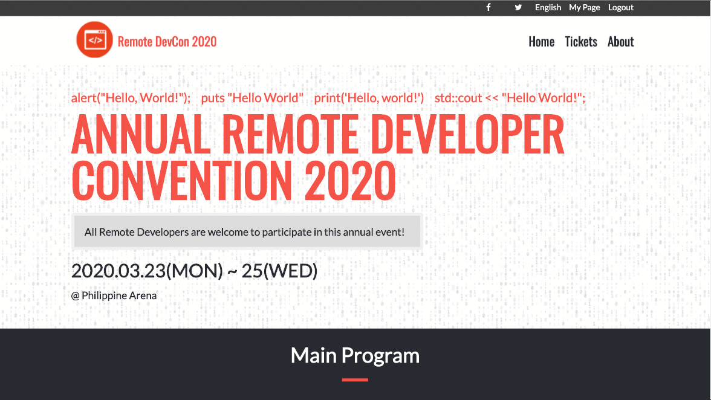

# Html-Css-Capstone-Project
HTML and CSS Capstone Project in Microverse

> Annual Remote Developer Convention 2020
> Remote DevCon 2020

[Video of Presentation](https://www.loom.com/share/)

## In this solo project I have: 

### Built Three pages, each with their own Desktop and Mobile version: 

- The Main Page
- The About Page
- The Tickets Page

### Each of these pages have versions for 2 different screen sizes: 

- mobile: up to 768px
- desktop: from 768px

### I did an extra effort and made the page responsive from 1920px all the way to 320px screen width.

### The colors, typographies, and layout of the original design were followed.

# What it does
It is an HTML page created using HTML, CSS and Bootstrap.

## Built With
- HTML5
- CSS3
- Bootstrap4

## Live Demo

[Live Demo](https://raw.githack.com/DennisOsido/Html-Css-Capstone-Project/Feature/index.html)

## Getting Started

To get a local copy up and running follow these simple example steps.
- Clone the project unto your local machine
- `cd` into the project directory
- open index.html in your browser

## 🤝 Contributing

Contributions, issues and feature requests are welcome! Start by:
* Forking the project
* Cloning the project to your local machine
* `cd` into the project directory
* Run `git checkout -b your-branch-name`
* Make your contributions
* Push your branch up to your forked repository
* Open a Pull Request with a detailed description to the development branch of the original project for a review

##### Please feel free to contribute to any of these!

Feel free to check the [issues page](https://github.com/DennisOsido/Html-Css-Capstone-Project/issues).

## Attributions and Credit

https://meyerweb.com/eric/tools/css/reset/ for CSS Reset Stylesheet

The readme format was taken from Mr. Tolulope Olusakinin which is one of our TSE's in Microverse.

Design idea by Cindy Shin in Behance:
https://www.behance.net/gallery/29845175/CC-Global-Summit-2015

Ancient Filipino Font downloaded from: 
https://www.lexilogos.com/keyboard/font/TagDoc93.ttf

Webfont generated from:
https://www.fontsquirrel.com/tools/webfont-generator

## Show your support

Give a ⭐️ if you like this project!

## 📝 Copyright

This project is created by the efforts of:
- https://github.com/DennisOsido (Solo Project)

### Enjoy!